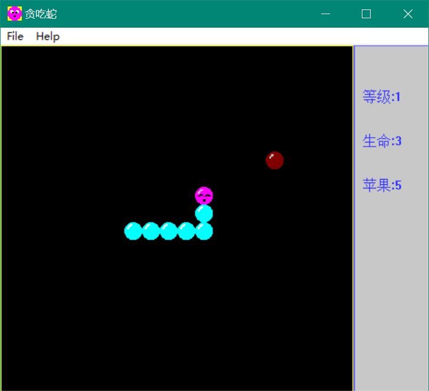

# 贪吃蛇

## 简介

经典的贪吃蛇小游戏。

## 技术

程序采用了OOP和模块化的思想，使得逻辑比较清晰。采用Windows编程构造窗口界面，基于实时游戏的框架，利用消息处理机制处理用户输入，用定时器的方法按一定时间间隔刷新游戏内容并更新界面。游戏背景音乐采用MIDI，音效采用wav。

程序采用的是Windows API，没有采用MFC。对于实时游戏，采用纯Windows程序能够充分发挥性能，并排除无关的干扰，使得程序的灵活性更高。

## 环境

* Visual Studio 2017
