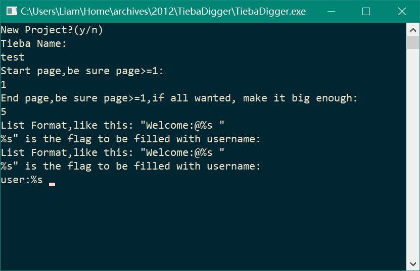
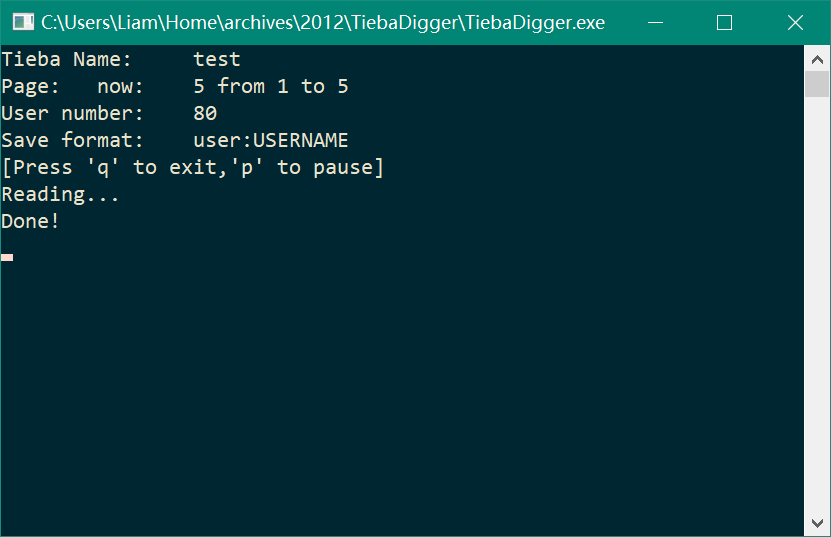

# 贴吧用户ID挖掘机

|   |   |
|---|---|

## 简介

这是一个用来挖掘贴吧用户ID的程序，能够将某个贴吧的所有用户名都按格式记录下来，可用于@大量用户。

## 技术

程序用C语言写成的，使用Windows网络编程。采用socket通信发出get请求，返回含有贴吧ID的页面，得到页面源码后，程序对其进行解析，提取ID信息并格式化保存。

## 环境

* Visual Studio 2017
