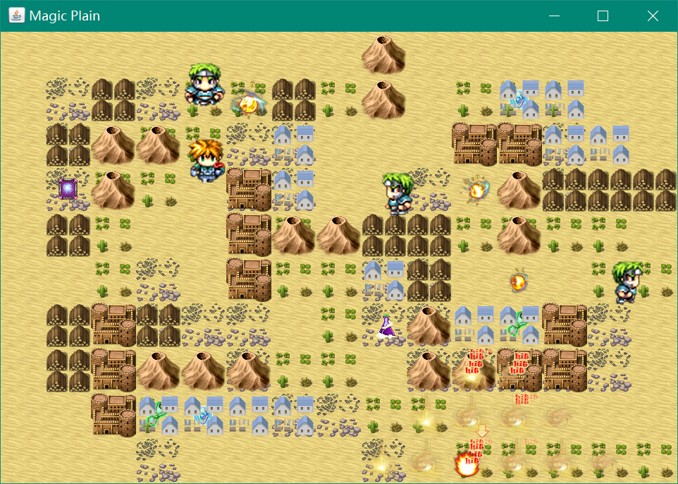
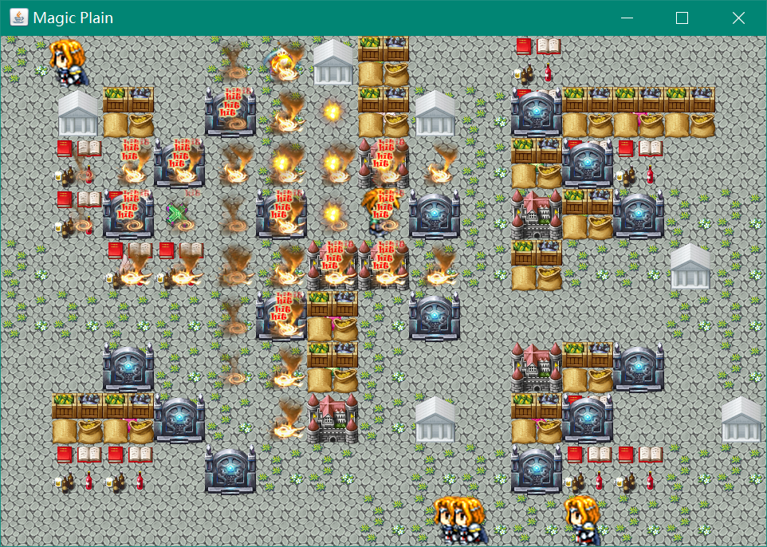
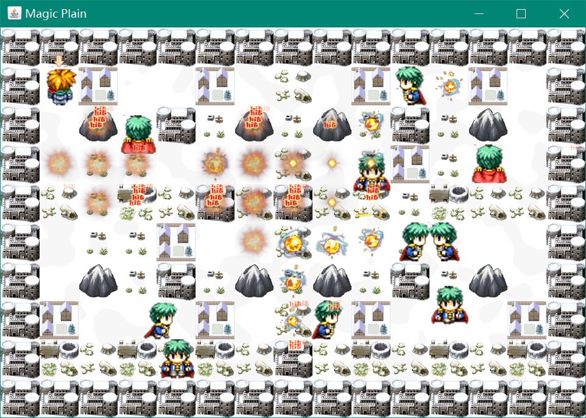

# Magic Plain

|   |   |   |   |
|---|---|---|---|

## 简介

一个用Java写的2D的游戏，类似于炸弹超人，不过比炸弹超人内容更加丰富。不仅道具的种类很多，而且炸弹爆炸效果也是多种多样的。游戏设置了多个场景，十六张地图，每个场景的道具都不相同。

## 技术

游戏采用纯Java编写，绘图方面采用了双缓存技术，使得动画比较流畅。地图的制作用到了Tilemap，通过研究tmx文件的结构，总结出了tmx的构造规律，实现了该类型地图文件的解析。

游戏中加入了人工智能，敌人会靠近玩家并放置炸弹来攻击玩家，会躲避炸弹，还会寻找并收取道具。人工智能采用的是A星算法结合模糊算法。

## 环境

* Intellij IDEA

