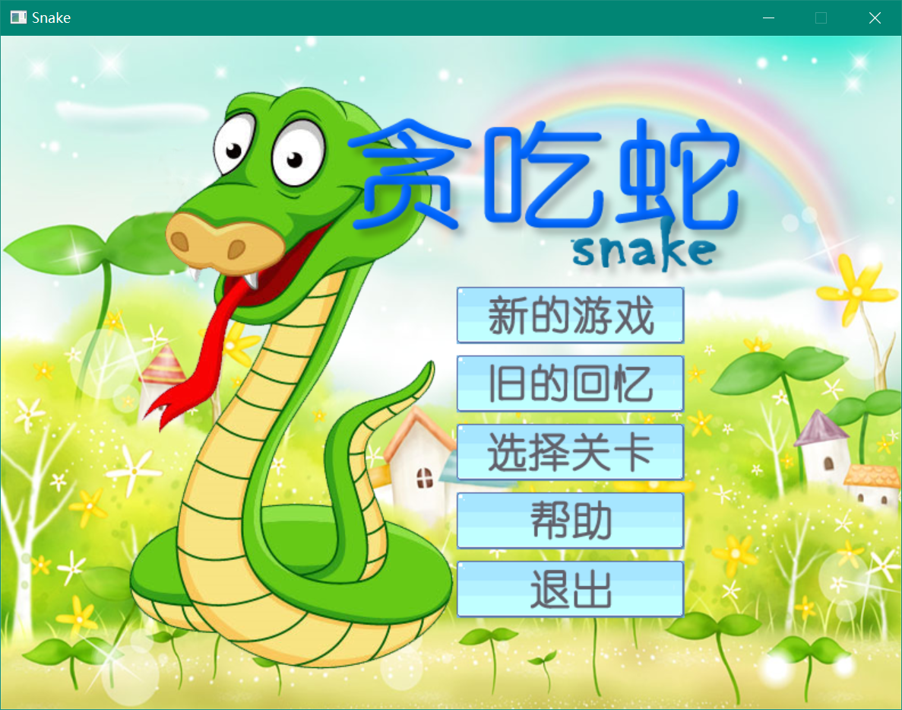
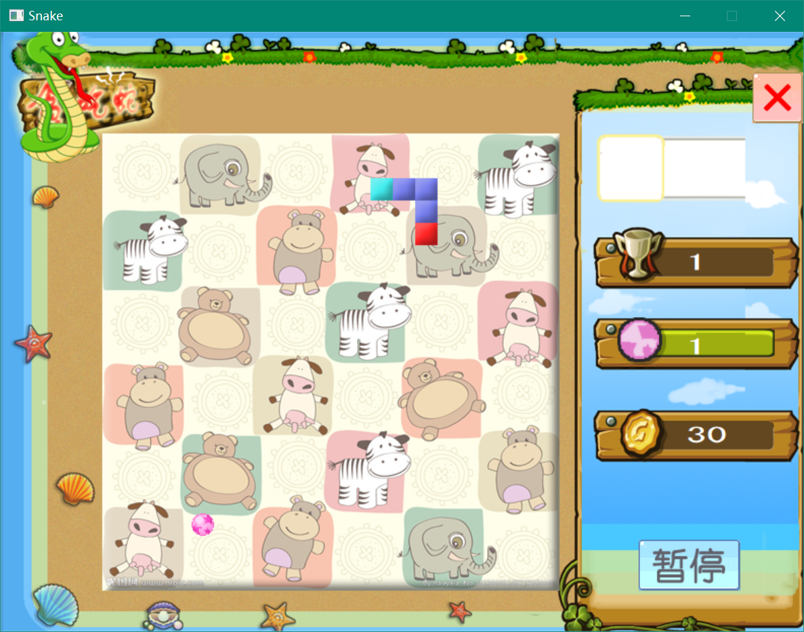
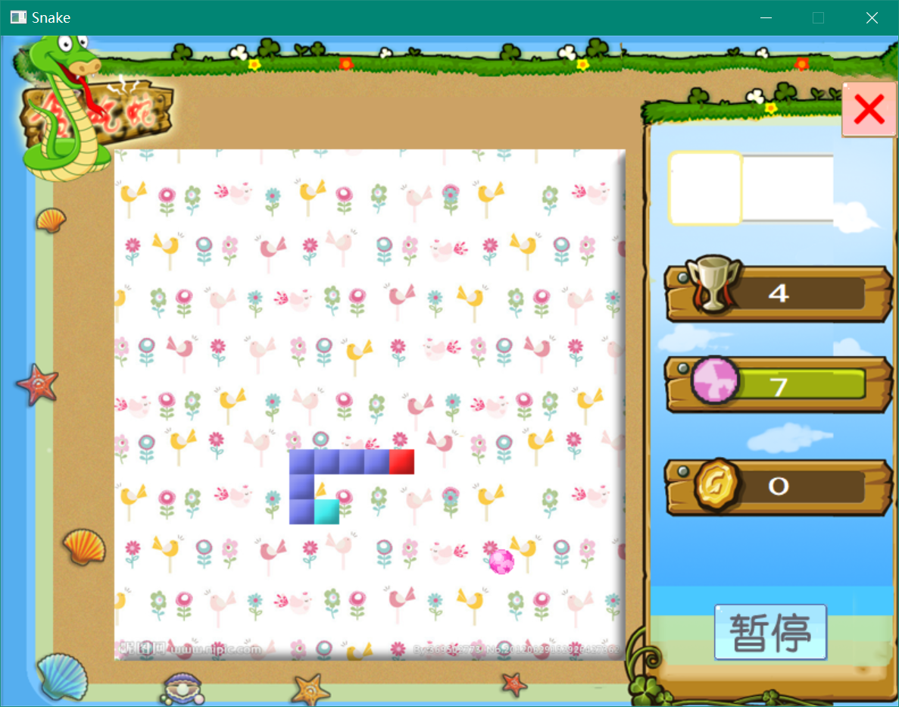

# 贪吃蛇（二）

|   |   |   |
|---|---|---|

## 简介

传统的贪吃蛇游戏，实现蛇的移动、进食、增长以及死亡过程，并统计所得分数。游戏面板划分为许多小格，蛇移动时每次只移动一格。食物随机放置，但不能放到蛇身。每进食一次，蛇身增长一格，得分相应增加。蛇碰到边界时转到对面边界出来。当蛇头碰到自身时，蛇死亡，游戏结束。

程序具有良好的可视化操作界面，有良好的声音效果。通过键盘鼠标控制，并且实现用户菜单及提示信息。游戏采用实时控制和动画刷新，保证系统稳定流畅运行。能够根据游戏规则自动判断游戏状态，并将信息实时反馈给用户。

游戏启动时显示游戏LOGO或加载信息，随后进入菜单界面，可选菜单要有：新的游戏、继续游戏、选择关卡、帮助及退出。游戏时，左边及中心显示游戏面板，右边显示信息栏。通过上下左右四个方向键控制蛇的移动，通过鼠标进行按钮的点击。游戏能够在任何时候暂停和退出游戏。通过关卡或者失败时，显示全屏的提示信息，并提供按钮供用户选择。游戏加入音乐功能模块，实现音效和背景音乐的播放。

## 技术

### 游戏控制模块：

游戏控制类的成员包含有窗口的基本信息，游戏资源管理类对象，面板类对象。在窗口建立好后接着构造游戏控制类，实现对其他部分类的初始化工作，并调用资源管理类进行资源的加载以及绘图设备的初始化。

游戏控制类采用状态进行驱动，通过改变记录状态的变量实现流程的跳转。

在游戏开始进行时，游戏控制模块负责面板的创建，从而建立起游戏规则类对象。游戏控制类接管了窗口的定时器消息，定时对游戏进行更新。许多页面的显示，例如菜单页面、成功页面、失败页面、帮助信息页面都由游戏控制类负责。

此外，游戏控制类实现了游戏存档的读取与保存。

### 资源管理模块：

资源管理模块用Manager类实现，Manager类依赖Picture类、Tile类、Animation类和Mid类，用四个顺序容器分别储存四个类的对象，实现资源的统一管理。此外Manager类实现了对背景音乐的控制。

### 交互元素模块：

以Elebase为虚基类，只要能在屏幕上画出来的都看做交互元素，每个交互元素必须与一个动画对象相关联，且都从Elebase依次多层继承下去。Elebase类储存有动画指针，提供的绘图的虚函数。

### 游戏规则模块：

游戏规则模块是游戏的核心，它构成了一个独立的系统，控制着游戏的运行。能读取键盘按键状态，并将游戏跳转信息发给游戏控制模块。游戏规则模块包括Food类、Node类、Panel类、Snake类，Food类保存食物信息并随机产生食物，Node类为蛇的节点类，Panel类是游戏的控制类，实现游戏的更新与画面的刷新，并检测游戏的状态。此外Panel有一Snake类的子对象。Panel类通过检测按键，向Snake类发送改变方向的消息，并让其移动。在每一帧中，Panel会检测蛇的长度、蛇是否已撞到自身，从而做出相应的响应。蛇的身体由一个Node顺序容器构成，Node类包含的成员主要有坐标、方向。蛇移动时，从尾开始，每个节点的位置都移动到下一个节点位置，最后一个节点（即蛇头）则根据蛇的方向移动。

### 绘图模块:

本游戏通过Windows GDI实现图形的绘制。其基本绘图过程为：加载位图、创建兼容设备，位块传输。由于考虑到游戏的刷新率较高，直接绘图会产生闪动的现象，所以采用了双缓冲技术。双缓冲的基本原理是：把图画全部画到缓冲设备上，再在最后一次性位块传输到原设备上。

### 音效模块：

游戏中采用wav声音作为普通的短暂的音效，这种音效的播放分散在程序的各个地方。具体的播放方法是调用PlaySound函数，即时加载即时播放。对于背景音乐，则采用mid格式文件。mid文件具有格式小，播放简单的特点，其实现方法是调用mciSendCommand函数。

### 错误处理模块：

错误处理类用来供程序抛出与捕捉程序，主要的类有Error基类、Init_Error类、Outer_Error类。通过错误处理模块，程序能够有序地处理错误。

## 环境

* Visual Studio 2017