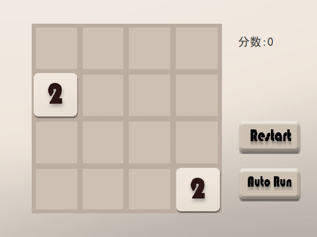
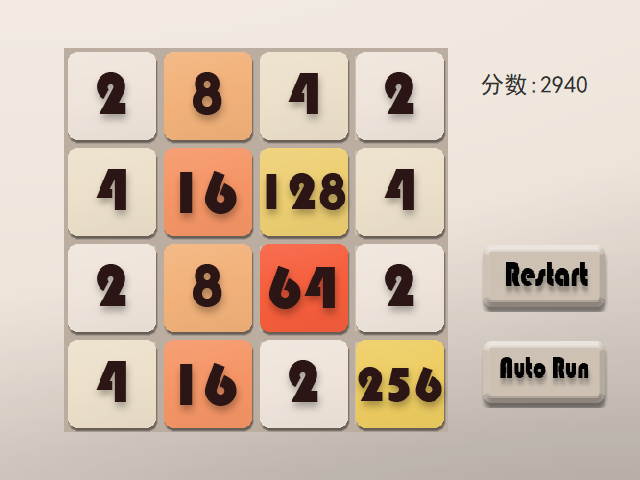

# Game2048

|   |   |
|---|---|

## 简介

这是一个用Java写的实现2048游戏的程序，加入了人工智能，能够自动运行。

## 技术

项目引入MVC架构的思想，将逻辑与界面分离。这个程序的难点在于AI算法，刚开始我的想法是用Alpha-Beta剪枝算法，但是效果不是很好，后面又改用了贪婪算法，虽然贪婪算法简单，但是结果并没有明显变差，重要的是评估函数的设定。评估函数的指标设置有：总的分数、总的步数、空格数、最大的离中心的距离、相邻数之差。经过多次的实验和指标权重的调整，使得评估的结果有了提升。

## 环境

* Intellij IDEA