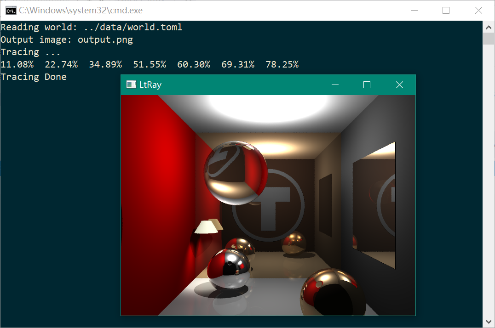

# LtRay 光线跟踪器



## 简介

一个用C++实现的简单光线跟踪器

[详细介绍](https://lianera.github.io/2017/ltray-memo/)

## 特性


* Shape: sphere, cone, plane, cylinder, disk, triangle, polygon
* Customed particial shape
* Source supported: own format, ply
* Output supported: ppm file, point cloud output(ply),glfw window preview
* Light: direction light, point light, spot light
* Shadow
* Mirror
* Refraction
* Camera: fov, orthogonal view, perspective view
* Grid acceleration
* Transformation: translation, scale, rotation
* Shader: phong, depth map, normal map, global spherical harmonics lighting, albedo map
* Anti-aliasing

## 运行

```
.\ltray data\world.toml
```


## 环境

* Visual Studio 2017
* 第三方库：opengl, glfw3

推荐使用vcpkg安装第三方库

```
vcpkg install opengl:x86-windows-static glfw3:x86-windows-static
```

