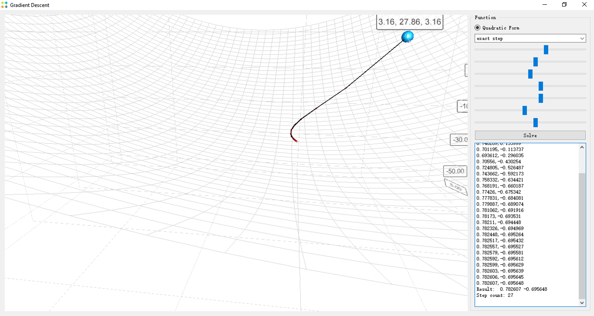

Numerical Optimization
==================================

# 简介

本程序实现了用梯度下降法求解二次型最优化问题的示例，能够对梯度下降法的过程进行可视化分析，并且能够交互地控制函数系数，提供函数图像的任意角度的可视化，能够实时的查看最优化过程。

其中二次型的表达式为f(x)=1/2*x'Ax - b'x + c，提供的梯度下降法的步长搜索包括精确步长和固定步长。

# 运行

本程序的发布版需要在Windows x64位的环境下运行，运行GradientDescent.exe，程序界面如下图所示：

其中左侧为可视化面板，可以用右键对函数图像进行拖拽以调整视角，用鼠标滚轮可以调整缩放系数，鼠标左键点击可以设置初始位置。界面右侧为控制面板，7个滑动条分别是对二次型的7个系数的调整，7个系数分别对应于A=[a11, a12; a21, a22]; b= [b1; b2]; c，通过这7个系数的调整，可以改变二次型函数的图像。

# 求解过程

1. 通过调整右侧的系数确定好函数形状，通过鼠标右键拖拽左侧视图调整视角
2. 在左侧函数图像上点击，确定好初始位置
3. 在右侧的组合框中确定好步长策略
4. 点击Solve，进行求解
5. 下面的文本框会列出求解的步骤以及最后的结果，同时左侧的可视化面板会将下降过程可视化出来