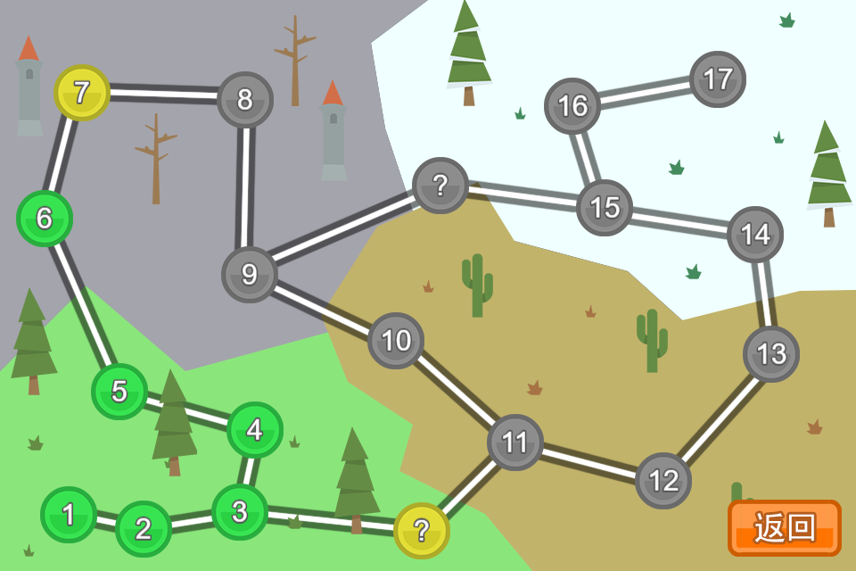
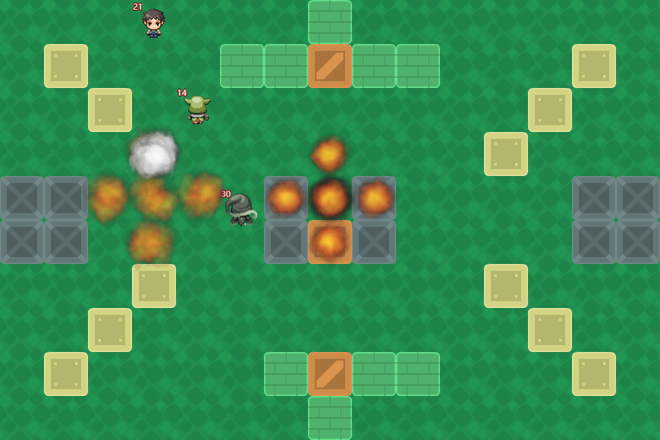
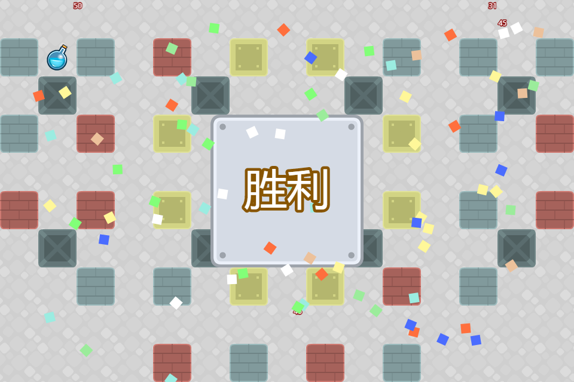

# Magic Plain v2

|   |   |   |   |
|---|---|---|---|

## 简介

一个类似炸弹超人的游戏，三年多前用Java写过第一版，这段时间用JavaScript结合[Phaser](http://phaser.io/)游戏引擎重写了一次。  

## 游戏设计 

游戏里面总共分为四幕，分别为草原、地下城、戈壁、雪地，以底色和砖块来进行区分，每一幕都有若干关卡，最终形成一个网状路径，通过最终关卡即算胜利。  

在游戏中，设置了几种道具，分别为加血瓶、加速瓶、激光弹、距离增长、范围加宽，这些道具隐藏在游戏中的木箱下，需要首先炸毁箱子才能获得。  

游戏角色设置包括：主角、僵尸猪人、幽灵、牛头人、蝙蝠王。角色的不同之处在于血量、移动速度、攻击力的不同。每个角色出场的时候炸弹类型都是一样的，只能通过道具来改变炸弹。其中每次炸弹爆炸的攻击力计算方法为主角攻击力乘以炸弹系数。

## 游戏AI

游戏开发的难点之一就在于AI，在游戏中，每个敌人都具有独立的决策能力，通过分析当前局势来决定行为。其中，敌人的行为有：空闲、躲避炸弹、获取道具、追逐玩家、放置炸弹。每当空闲或者局势改变的时候，计算每个行为的估值函数，选择估值最小的行为进行行动。关键就在于怎样设计各个行为的估值函数。 

* 空闲：当遇到死胡同，例如四周都是炸弹时，估值为0，其他时候估值为Infinity。
* 躲避炸弹：首先将游戏对象转换成二位数组，其中方块对于的值设置成其health值，炸弹周围区域设置成其攻击力，炸弹本身设置成自身攻击力的两倍，这样在进行路径规划的时候就能够尽可能避免炸弹和方块。在计算躲避炸弹行为估值的时候，需要顺便对躲避路径进行规划，这里我才用的是A星算法，A星算法常用来对两点之间的路径进行规划，不过，只要稍微改一下A星算法的估值函数，改成f(x) = g(x) - h(x)，这样路径规划的时候就会逃离目标点。  
* 获取道具：获取道具的估值设置成角色当前位置离道具的距离，这样当角色里道具比较近的时候会优先去获取道具。  
* 追逐玩家：估值函数与获取道具类似，估值设置成距离，路径规划则采用典型的A星算法，从角色位置规划处一条路径到玩家位置。  
* 放置炸弹：当玩家在自身炸弹攻击范围之内的时候，估值为-100，否则估值为Infinity，也就是只要玩家在附近，就放置炸弹。  

除了上面几个行为的估值项，还考虑过添加一致项，使得前后行为一致，但是实际效果并不好，比如逃跑的时候就只顾着逃跑了，即使玩家不远也不会主动去攻击玩家，丧失了灵活性。不过如果用轮盘赌的方法来随机保持前后行为一致性应该会好些。  

## 技术细节

游戏采用的引擎是[Phaser](http://phaser.io/)，使用JavaScript编写。  

游戏流程可以分为几个state：加载、菜单、选关、进行游戏，每个state展示独自的内容，只是在选关之后需要将选中的关卡传给进行游戏的state。  
游戏存档则保存在localStorage里面，保存每一个关卡是否通过的信息，在每次胜利的时候添加一条关卡通过的记录。 

## Attributions

* Credit Kenney (www.kenney.nl) for some images  
* Happy Arcade Tune by rezoner is licensed under [CC-BY 3.0](https://creativecommons.org/licenses/by/3.0/)  
* Stage X Music Track Flatshot by Rosalila is licensed under [CC-BY-SA 3.0](https://creativecommons.org/licenses/by-sa/3.0/)  
